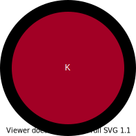
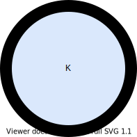
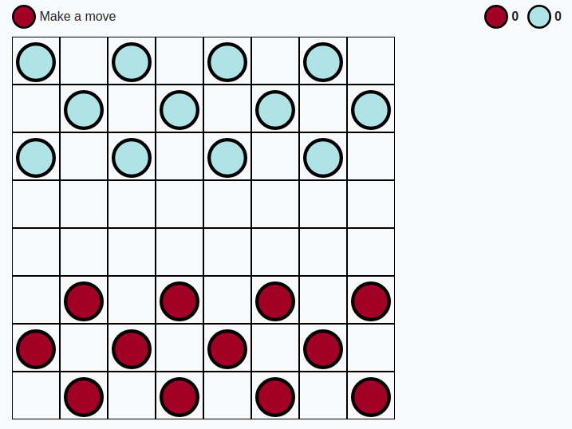

# <a href="https://sauravshah31.github.io/checkers/">Checkers</a>

    
        
            
        
        
            
        
    
    
        
            
        
        
            
        
    

 
 

    
        
    

## Rules
* The aim of the game is to eat up all the the opponent's checkers
* The checker can only be moved along the diagonal and should proceed towards opponent's side
* Once a player moves the check to the opponent's last row, the checker will be promoted to a king, and this king will be able to move diagonally in all direction (up/down)
* If there is an opponent's checker in the diagonal while making a move, you can eat the checker if the diagonal to the diagonal of your checker is empty. If you decide to eat the checker, you have to make another move also.
