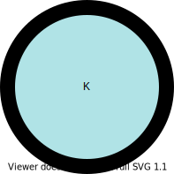

# <a href="https://sauravshah31.github.io/checkboard/">Checkboard</a>

    
        
            
        
        
            
        
    
    
        
            
        
        
            
        
    

 
 

    
        
    

## Rules
* A move can be made di
